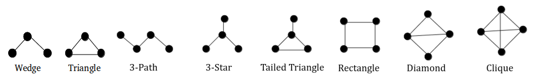

# Parallel Pattern Enumeration in Large Graphs 

Graphlet enumeration is a fundamental task in graph exploration and analysis. It has many real-life applications including biology and transportation. In this work, we presents a novel approach to extracting these patterns with SQL queries, in a distributed fashion. Our solution aims to enumerate all the emnbadded graphlets by stages. First, we enumerate all the possible wedges, then we use them to enumerate the intuitive patterns that include 3-Paths, 3-Star and rectangle. These patterns are used to enumerate the derived graphlets, with includes tailed triangles, diamonds and cliques. 

## Requirements

The contribution is developped with the SQL and the Python programming language. The minimal software requirements for the installation of this package are:

* Cluster: 4, 8, 9, 16, 27 or 81 hosts, each host with 4 cpu cores, 4 GB of main memory and 500 GB of disk at least. The cluster should define a shared-nothing architecture.
* OS: Linux Ubuntu server 18.06 or above.
* Language: Python 3.0 or higher.
* DBMS: Vertica DBMS or any other relational DBMS with partitioning control (please refer to this [page](https://www.vertica.com/docs/9.3.x/HTML/Content/Authoring/InstallationGuide/Other/InstallationGuide.htm?tocpath=Installing%20Vertica%7C_____0) for installation guidelines).
* Libraries: vertica_python client and Pandas.

## Setup
After installing the requirements, update the following lines in the code with your inputs:

<code> conn_info = {'database': database_name, 'port': 5433, 'user': username, 'password': password}</code>

## Running

### Data set
The data set to use should be the edge list. It should have two columns separated by a delimiter. This latter can be space, comma or tab.

In our work, we used different data sets from [snap](https://snap.stanford.edu/data/index.html) repository.

### Execution
On a terminal, use the following command to execute the code:

<code>python sqlgraphlet.py file=/link/to/graph_file,delimiter=[tab|comma|space],machines=k,colors=c</code>

The delimiter can be comma, space or tab.

The number of machines (machines) should be (colors)^2, (colors)^3 or (colors)^4.

For example, we can use 2 colors on a cluster of 8 machines. Hence, we can use the following code to execute the program on DBLP data set:

<code>python sqlgraphlet.py file=/home/username/DBLP.txt;delimiter=tab;machine=8;colors=2</code>

## Results

Our results contain two classes:
1. Execution time and total graphlet count: these results are directly output on the terminal.
2. The graphlet lists: 7 main tables are created in the database, that allow storing the results on each graphlet enumeration. 
	1. The table Wedge.
	2. The table Path.
	3. The table Star.
	4. The table Rectangle.
	5. The table Tailed.
	6. The table Diamond.
	7. The table Clique.

To investigate the content of these tables, the following query can be used:

<code>SELECT machine, count(\*) from table_name group by machine;</code>

table_name can be replaced with the name of the table, for example:

<code>SELECT machine, count(\*) from Rectangle group by machine;</code>

## Software license agreement

Details the license agreement of BSD: [LICENSE](LICENSE)

## Citation

Please use the following reference to cite our work:

Abir Farouzi, Xiantian Zhou, Ladjel Bellareche, Mimoun Malki, & Carlos Ordonez. (2023). Parallel Pattern Enumeration in Large Graphs. In the 34th International Conference on Database and Expert Systems Applications (DEXA 2023).

## Historic Contributors (core developers first)

* [Abir FAROUZI (core developer)](https://www.lias-lab.fr/fr/members/abirfarouzi/) (ESI-SBA and LIAS/ISAE-ENSMA)
* [Xiantian ZHOU](https://www2.cs.uh.edu/~xzhou/) (University of Houston)
* [Ladjel BELLATRECHE](https://www.lias-lab.fr/fr/members/bellatreche/) (LIAS/ISAE-ENSMA)
* [Mimoun MALKI](https://www.esi-sba.dz/fr/index.php/personnel/malki-mimoun/) (ESI-SBA)
* [Carlos ORDONEZ](https://www2.cs.uh.edu/~ordonez/) (University of Houston)
